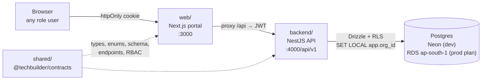

# techBuilder

Hindi-first **web portal for running an Indian construction SMB's daily field operations** — a records + visibility logbook. Field roles (Supervisor, Driver, Worker) log daily records; they roll up to Site Manager / Accountant / Owner dashboards with approvals, a two-tick money rule, and Excel export.

**Full-stack monorepo** (npm workspaces): `shared` (frozen contracts) → `backend` (NestJS API + Postgres) → `web` (Next.js portal).

> Folder-by-folder detail + diagrams: [docs/README.md](docs/README.md) · Project memory & build status: [CLAUDE.md](CLAUDE.md)

## Repository map — what each folder is for

```
techBuilder/
├── shared/      📜 @techbuilder/contracts — FROZEN single source of truth
│                   (enums, domain types, DTOs, REST endpoints, RBAC matrix,
│                    DB schema + RLS SQL). Backend & web both import from here.
├── backend/     ⚙️ NestJS API server (port 4000, /api/v1) — Drizzle ORM →
│                   Postgres (Neon) with Row-Level Security. All business
│                   logic: auth, RBAC, approvals, money ledger, exports.
├── web/         🖥️ Next.js portal — the ACTIVE frontend. One route group per
│                   role (/owner, /site-manager, /supervisor, /accountant,
│                    /driver, /worker). httpOnly-cookie auth, Tailwind+shadcn.
├── app/         🧊 FROZEN Expo/React Native Android app (pre-pivot).
│                   Reference only — do NOT build on it.
├── docs/        📚 All specs, plans, research, deployment guides.
├── deploy/      🚀 Production infra config — Caddyfile (reverse proxy+TLS),
│                   systemd units for backend & web on EC2.
├── scripts/     🔧 Ops shell scripts — DB backup/restore, deploy-backend,
│                   verify-production.
└── .github/     🤖 CI/CD workflows — ci.yml (build+tests), deploy.yml, backup.yml.
```

## How the pieces connect



- **`shared/` is frozen** (`1.0.0-frozen.9`): every enum, type, endpoint path, permission, and the DB schema live there once — backend and web never redefine them.
- **`backend/`** enforces everything: JWT auth, per-role RBAC, org isolation via Postgres RLS (`runInTenant`), approvals + accountant two-tick verification, wage math, Excel exports.
- **`web/`** is a thin, role-routed UI over the API — screens only talk through adapter interfaces / fetch to `/api/v1`.

## Deployment (where things go)

| Piece | Target | Config lives in |
|---|---|---|
| Backend API | AWS EC2 (`ap-south-1`), systemd + Caddy — earlier Railway deploy also exists | `deploy/`, `scripts/deploy-backend.sh`, `railway.json` |
| Web portal | Vercel (region `bom1`) or EC2 systemd (Phase 2) | `web/vercel.json`, `deploy/systemd/techbuilder-web.service` |
| Database | Neon Postgres today → RDS `ap-south-1` per plan | `docs/deployment/DATABASE_MIGRATION.md` |
| CI/CD | GitHub Actions | `.github/workflows/{ci,deploy,backup}.yml` |

Full deployment runbooks: [docs/deployment/](docs/deployment/).

## Run the full project locally (2 terminals)

One-time: `npm install` from repo root; confirm `backend/.env` + `web/.env.local` exist (copy from their `.env.example` — `backend/.env` needs the real Neon `DATABASE_URL`).

**Terminal 1 — build contracts, then build + start the backend:**
```bash
(cd shared && npm run build) && (cd backend && npm run build && npm start)
```
Wait for `techBuilder API on :4000/api/v1`.

**Terminal 2 — start the web frontend:**
```bash
(cd web && npm run dev)
```

**Open** [http://localhost:3000](http://localhost:3000) → seeded dev org `devco`, password always `changeme123` (quick-fill buttons on the login page):

| Username | Role |
|---|---|
| `owner` | Owner |
| `sm1` | Site Manager |
| `acct1` | Accountant |
| `th1` / `th2` | Supervisor |
| `driver1` / `driver3` | Driver |
| `worker1` | Worker |

Quick sanity check:
```bash
curl -s http://localhost:4000/api/v1/health          # backend alive
```

## More

- [docs/README.md](docs/README.md) — detailed folder/role breakdown with diagrams (start here to understand the repo).
- [docs/CODEBASE-INDEX.md](docs/CODEBASE-INDEX.md) — file-by-file map of `shared/` + `backend/` + `web/`.
- [docs/techBuilder-Developer-Guide.md](docs/techBuilder-Developer-Guide.md) — "where do I change what" playbook.
- [docs/techBuilder-Web-Local-Dev-Startup.md](docs/techBuilder-Web-Local-Dev-Startup.md) — local-run guide with full troubleshooting.
- [CLAUDE.md](CLAUDE.md) — project memory, build status, frozen conventions.
