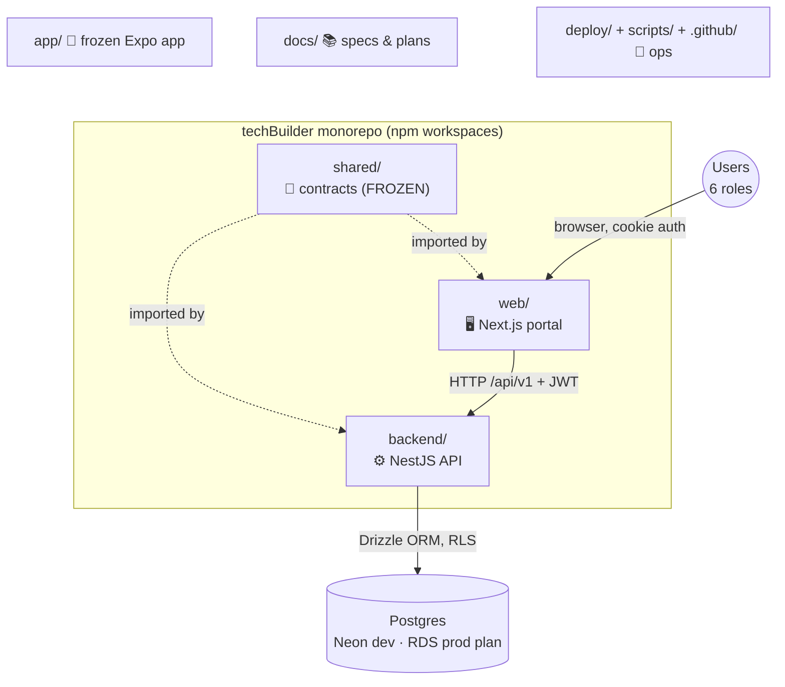
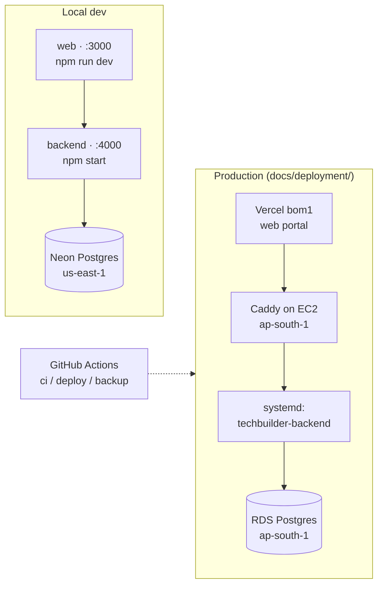

# techBuilder — Repository Structure Guide

> **What this file is:** the folder-by-folder map of the whole full-stack project — what each major folder does, why it exists, and how they fit together. Deliberately stays at the *major folder* level; for a file-by-file map see [CODEBASE-INDEX.md](CODEBASE-INDEX.md).

---

## 1. The big picture

techBuilder is a **Hindi-first web portal** for an Indian construction SMB's daily field operations: field roles log records (attendance-free since Round 2 — expenses, fuel, materials, progress, issues), money flows through an approval + accountant-verify ("two-tick") pipeline, and everything rolls up to Owner dashboards + Excel export.

**One npm-workspace monorepo, three active packages + support folders:**

**Request flow:** Browser → `web/` (Next.js, httpOnly-cookie session, proxies API calls) → `backend/` (NestJS on `:4000/api/v1`, JWT + RBAC + per-org Row-Level Security) → Postgres.

**The 6 roles** the product serves: **Owner** · **Site Manager** · **Accountant** (money desk, two-tick verify) · **Supervisor** (heads workers + drivers) · **Driver** · **Worker** (view-only-ish).

---

## 2. Folder-by-folder

### `shared/` — 📜 The Contracts Pack (`@techbuilder/contracts`, FROZEN)

**Role:** the single source of truth every other package imports. Nothing is ever redefined outside it.
**Why it exists:** freezing contracts first lets backend and frontend be built independently against a fixed spec without drift.

| Inside | What it holds |
|---|---|
| `src/enums.ts` | All enums (roles, record types, statuses) as `as const` arrays |
| `src/domain.ts` / `src/dto.ts` | Entity types + create/mutate input types |
| `src/api.ts` | The complete REST `ENDPOINTS` list (backend controllers must match exactly) |
| `src/permissions.ts` | The RBAC matrix + `can()` helper |
| `src/config.ts` | `OrgConfig` (zod) — per-org settings shape |
| `src/adapters.ts` | `AuthClient` / `RecordsClient` / `SyncClient` interfaces — screens only talk through these |
| `src/db/schema.ts` + `src/db/rls.sql` | Drizzle Postgres schema (30+ tables) + Row-Level-Security policy DDL |

⚠️ **Editing anything here = a contracts version bump** (currently `1.0.0-frozen.9`) — see `.claude/rules/contracts-frozen.md`.

### `backend/` — ⚙️ The API server (NestJS 11 + Drizzle + Postgres)

**Role:** all business logic and enforcement — auth (JWT), per-role RBAC, org isolation (RLS via `runInTenant`), approvals, the accountant two-tick money rule, wage math, dashboards, Excel export email.
**Why it exists:** the web portal is deliberately thin; every rule is enforced server-side.

| Inside | What it holds |
|---|---|
| `src/<module>/` | ~25 resource modules, each `controller + service + module` (auth, users, sites, people, records, approvals, cash-transfers, vendors, accountant, complaints, fuel-stock, materials, vehicles, vehicle-docs, wage, dashboards, insights, exports, sync, …) |
| `src/db/`, `src/common/` | `runInTenant` (RLS tx), scope/RBAC utilities, business-date logic, error envelope |
| `drizzle/` | Generated SQL migrations (applied to Neon) |
| `sql/` | Hand-written SQL: `auth.sql` (login lookup), RDS bootstrap |
| `merchants/` | Seed templates (org.json + CSVs) for onboarding a new client org |
| `scripts/` | One-off ops scripts (merchant seeding, data backfills) |
| `test/` | Integration tests that run against the live Neon DB |

Runs on **`:4000`**, all routes under **`/api/v1`**. Unit tests: `npm test` · integration: `npm run test:integration`.

### `web/` — 🖥️ The active frontend (Next.js App Router)

**Role:** the portal users actually open — mobile-first responsive, Hindi-first, PWA-ready.
**Why it exists:** frontend pivoted from Android/Expo to web (2026-07-03); this replaced `app/`.

| Inside | What it holds |
|---|---|
| `src/app/<role>/` | One route group per role: `owner/`, `site-manager/`, `accountant/`, `supervisor/`, `driver/`, `worker/` — each with its dashboard, lists, forms, profile |
| `src/app/login/`, `change-password/` | Auth screens (httpOnly-cookie session — no tokens in JS) |
| `src/app/api/` + `src/proxy.ts` | Server-side proxy: browser → Next.js → backend, attaching the JWT from the cookie |
| `src/components/`, `src/lib/` | shadcn/ui components, TanStack Query hooks, i18n, formatting utils |
| `vercel.json` | Vercel deploy config (region pinned to `bom1` Mumbai) |

Stack: TypeScript strict · Tailwind · shadcn/ui · TanStack Query · react-hook-form + zod (schemas from `shared/`).

### `app/` — 🧊 FROZEN Expo/React Native app (do not build on)

**Role:** the original Android frontend, frozen at the 2026-07-03 pivot. Kept only as reference (screen logic, i18n keys, adapter usage patterns). No new work goes here.

### `docs/` — 📚 All specs, plans, and research (you are here)

| Inside | What it holds |
|---|---|
| `CODEBASE-INDEX.md` ⭐ | File-by-file map of shared/backend/web — read instead of exploring the tree |
| `techBuilder-Developer-Guide.md` ⭐ | "Where do I change what" — the playbook for any add/change task |
| `techBuilder-Build-Readiness-Spec.md` ⭐ | The authoritative build contract (wins on conflict) |
| `deployment/` ⭐ | The production AWS deployment runbooks (EC2 + RDS `ap-south-1`, security, backup, rollback, costs) |
| `perf/` | Performance diagnosis (Neon latency) + AWS testing setup |
| `client-plan/` | Client-facing plan set (Round 1 as built + Round 2 delta + merged target) |
| `role-page-map/` | Role → page → section inventory + per-role update specs |
| `research/`, `reference/` | Research prompts/results + original binary docs (PDF/DOCX) |
| remaining `techBuilder-*.md` | Domain model, roadmap, tech stack, pivot record, work orders, etc. |

### `deploy/` — 🚀 Production infra config

| File | Purpose |
|---|---|
| `Caddyfile` | Caddy reverse proxy + automatic TLS in front of the backend (and web in Phase 2) on EC2 |
| `systemd/techbuilder-backend.service` | Runs the NestJS API as a service on EC2 |
| `systemd/techbuilder-web.service` | Runs the Next.js portal as a service on EC2 (Phase 2 option) |

### `scripts/` — 🔧 Ops shell scripts (repo root)

| Script | Purpose |
|---|---|
| `backup-database.sh` / `restore-database.sh` | Postgres dump/restore |
| `deploy-backend.sh` | Build + ship the backend to the EC2 box |
| `verify-production.sh` | Post-deploy smoke checks |

### `.github/workflows/` — 🤖 CI/CD

| Workflow | Purpose |
|---|---|
| `ci.yml` | Build + typecheck + tests on push |
| `deploy.yml` | Deploy pipeline to the EC2 production box |
| `backup.yml` | Scheduled database backup |

### Root files worth knowing

| File | Purpose |
|---|---|
| `package.json` | npm **workspace root** (hoists deps for shared/backend/web/app) |
| `CLAUDE.md` | Project memory for AI sessions — build status, conventions, doc map |
| `railway.json` | Earlier Railway backend deploy config (superseded by the EC2 plan, still functional) |
| `eas.json` | Expo build config (frozen with `app/`) |

---

## 3. Where things run (deployment map)

- **Push flow:** commit → GitHub → `ci.yml` (build + tests) → `deploy.yml` / `scripts/deploy-backend.sh` → EC2 systemd restart → `verify-production.sh`.
- **Database:** Neon (dev/today) → RDS `ap-south-1` per [deployment/DATABASE_MIGRATION.md](deployment/DATABASE_MIGRATION.md).
- An earlier **Railway** backend deploy exists (`railway.json`) — predates the EC2 plan.

---

## 4. Rules of the road (summary)

1. **Never redefine** an enum/type/endpoint outside `shared/` — import it. Editing `shared/src/**` requires a version bump.
2. **New backend module?** Copy the `backend/src/sites/` pattern exactly (`runInTenant`, idempotent UUID inserts, `mapXxx`, RBAC guard). See `.claude/rules/backend-modules.md`.
3. **Screens never call fetch/axios directly** — adapter interfaces / the proxy only.
4. Money = integer paise · IDs = client UUIDv7 · time = UTC + Asia/Kolkata business date · soft-delete everywhere. Full list: `.claude/rules/conventions.md`.
5. For any "add feature X to role Y" task, start at [techBuilder-Developer-Guide.md](techBuilder-Developer-Guide.md) §10.
