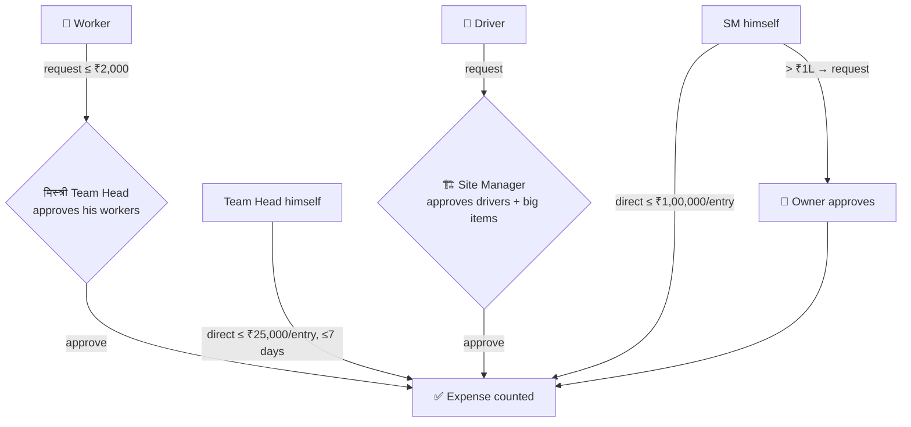

# Round 1 Plan — the app as first agreed & built

> **Status: BUILT & LIVE** (shipped 2026-07-08). **Superseded in parts by Round 2** — see [`2ndroundplan.md`](2ndroundplan.md) for what changed and [`finalPlan.md`](finalPlan.md) for the complete current target. Diagrams: [`1stroundindex.html`](1stroundindex.html).

## 1 · What the app is

A Hindi-first web app for running a construction company's **daily field records**: who spent what, what work happened, how each vehicle ran — everything with photo/voice proof, rolling up to the Owner.

## 2 · The 5 roles (Round 1)

| Role | Charter |
|---|---|
| **Owner · मालिक** | Sees everything from every site — every rupee, photo, approval |
| **Site Manager · साइट मैनेजर** | In charge of ONE site; approves requests, manages people/vehicles/settings |
| **Team Head · मिस्त्री** | Leads a team of **workers only**; enters team expenses + site progress |
| **Driver · ड्राइवर** | Runs one vehicle; morning/evening updates with photos; reports **directly to the SM** (no Team Head above him) |
| **Worker · मज़दूर** | View-only + one form: the expense request |

**Golden rule:** data flows UP, never sideways. Each site is a sealed box — a Site Manager never sees another site.

## 3 · Money (Round 1 — the threshold ladder)

- Worker/Driver: request only, within a limit; approver = Team Head (workers) / Site Manager (drivers, big items).
- Team Head: direct up to ₹25,000/entry within 7 days; above → SM request.
- Site Manager: direct up to ₹1,00,000/entry; above → Owner request.
- Every limit is set by the person one level above. A person can never approve his own request.

## 4 · What each role had (Round 1 point codes)

| Code | Feature (short) |
|---|---|
| W-1…W-4 | Worker: ID card, emergency call footer, expense request form (amount/date/category/bill photo/voice), everything else blocked |
| D-1…D-7 | Driver: vehicle card, compulsory morning meter-photo form, optional evening form (reading/hours/loads), expense request, self vehicle-switch for allowed types (SM notified) or request for others, damage report with full lifecycle (raise → SM resolves → driver closes) |
| T-1…T-6 | Team Head: per-person team insights, direct expense ≤₹25k, progress report 2×/day (~20 photos + voice), approves his workers' requests, adds people (cannot deactivate) |
| S-1…S-8 | SM: day-wise dashboard + insights page, direct expense ≤₹1L, progress, approval center, fleet drill-downs + vehicle analytics (7/30/90-day averages, monthly cost — SM + Owner only), people control incl. deactivate, settings (limits/categories/form-fields/emergency numbers), one-site sealed box |
| O-1…O-2 | Owner: sees all of the above across sites; Excel reports; company-wide defaults |
| M-1…M-4 | Money ledger (khata): every hand-over recorded, approved expenses cut the spender's balance, everyone sees own khata (received · spent · left), owner's "where did my ₹1L go" rollup |
| V-1…V-3 | Vendors/shops: per-site shop list, buy on credit (udhaar) via the same forms, shop khata (purchased · paid · balance) |
| N-1…N-5 | NOT in phase: attendance (manual register), wages, leave, material/stock tracking, auto reminders |
| SUG-1…6 | Suggestions: WhatsApp digest (pending), budget alert (pending), vendor list (became V), photo album / daily PDF / vehicle-paper alerts (phase 2) |

## 5 · What Round 2 later changed (pointer)

Team Head → **Supervisor** (now over workers AND drivers) · new **Accountant** role owning all money verification · SM ladder removed · attendance removed · diesel double-check · materials catalog · complaint box · personal salary khata. Full detail: [`2ndroundplan.md`](2ndroundplan.md).
