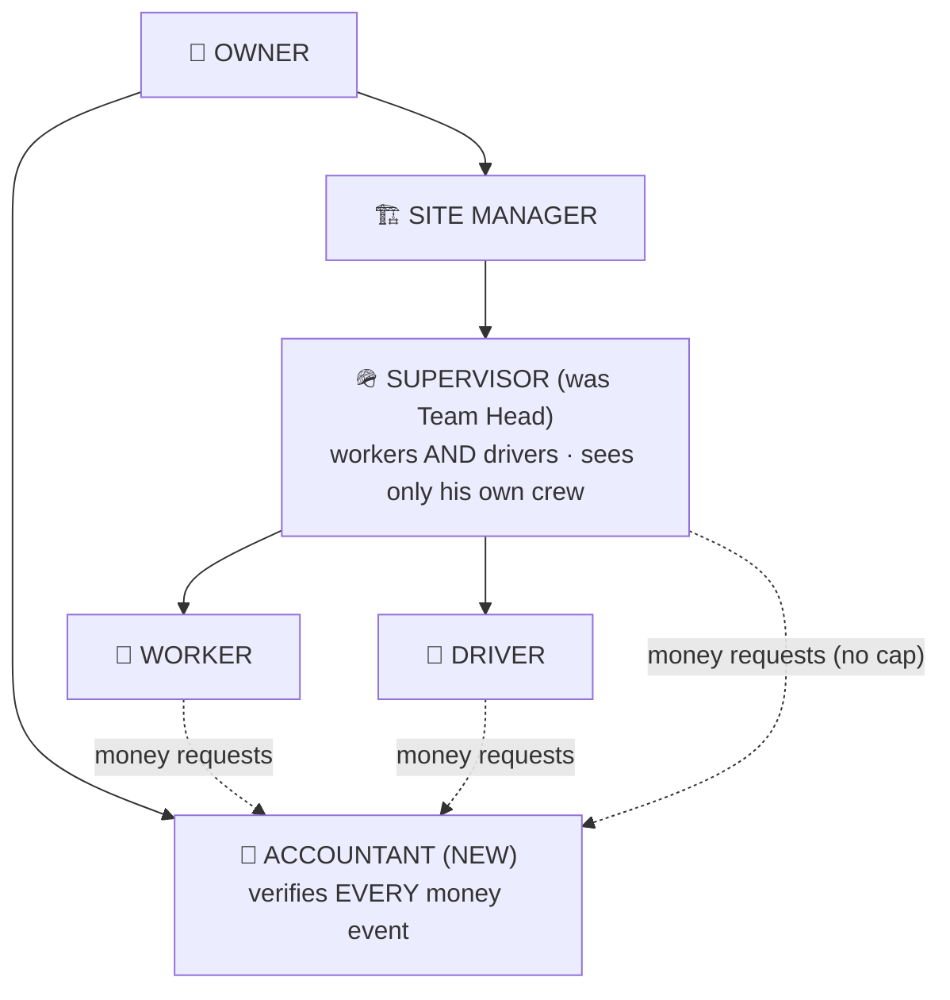
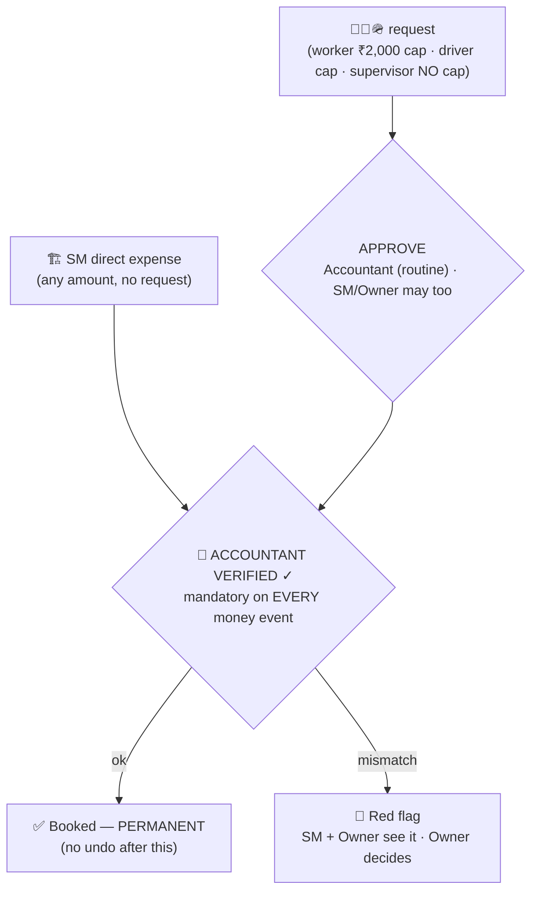

# Round 2 Plan — what changes from Round 1

> **Status: AGREED WITH CLIENT (2026-07-12), NOT YET BUILT.** This is the *delta* — every change from [`1stroundplan.md`](1stroundplan.md). The complete merged picture is [`finalPlan.md`](finalPlan.md). Diagrams: [`2ndroundindex.html`](2ndroundindex.html). Developer spec: [`../techBuilder-Client-Changes-Round2-Supervisor-Accountant.md`](../techBuilder-Client-Changes-Round2-Supervisor-Accountant.md).

## 1 · Role changes

| Before (Round 1) | After (Round 2) |
|---|---|
| 5 roles | **6 roles** |
| **Team Head (मिस्त्री)** — workers only; drivers reported straight to SM | **Supervisor (सुपरवाइज़र)** — heads **workers AND drivers**; every worker/driver has exactly ONE supervisor; a supervisor sees ONLY his own crew's requests |
| No money role | **Accountant (अकाउंटेंट) — NEW.** Every money event must carry his VERIFIED tick. Sees money and only money |

## 2 · Money changes (the big rewire)

| Before | After |
|---|---|
| Threshold ladder: TH approves workers ≤ his tier, SM ≤₹1L, Owner above | **Two-tick rule:** every money event = an APPROVAL + a separate **ACCOUNTANT-VERIFIED ✓**. SM/Owner may approve a request, but it still waits for the accountant's tick. Nothing auto-approves |
| TH direct expense ≤₹25,000 | Supervisor direct = **₹0**. His own requests have **NO cap** (₹10k, ₹50k — any amount); worker stays ₹2,000 default; driver has his own cap |
| SM direct ≤₹1L, above → Owner request | **Ladder removed.** SM books directly (any amount) — but **every SM expense is verified by the accountant afterwards**, who can reject/red-flag it before verification; flags go to the Owner |
| Approvals could in principle be revisited | **Approved + verified = permanent.** No undo, no re-reject |
| Anyone up-chain handed cash down | **Only three givers: Owner, SM, Accountant.** Every give is a claim the accountant verifies |
| — | **Personal money tags (NEW):** a give is marked **SALARY** or **PERSONAL**; after the accountant verifies it, it appears in the receiver's own khata with the tag |
| Khata = received/spent/left | **"Money I've taken" page (NEW)** for EVERY user — a date-wise list of only his own verified draws ("10 Jul — ₹5,000 — salary"), so nobody argues about what was taken |
| — | **Vendor money-IN (NEW):** a trusted vendor can hand the site money (₹50,000); accountant records it; the vendor khata shows both directions |

## 3 · New checks & features

| Change | What it is |
|---|---|
| **Diesel double-check** | Supervisor buys **bulk stock** (e.g. 500 L) → issues per vehicle ("40 L to vehicle X") → that driver logs receipt → accountant matches both sides (vehicle + day + litres). Match = verified once (not double-counted). Mismatch / one side missing by day end → 🚩 to Accountant + SM + Owner; Owner resolves |
| **Materials** | SM creates the material types (10–20) — each type carries its own on/off settings for **who fills what** (supervisor-only / supervisor + driver picks / view-only). **Supervisor's entry is FINAL** (he is the accountable person); **driver picks are data-only** ("7 trips of sand"); accountant reviews; match = verified; mismatch → 🚩 |
| **Worker ID card + guardian** | Worker's mobile + parent/guardian name + guardian mobile — filled once at joining; afterwards **only the SM (and Owner) can edit**. For emergencies: SM/Owner can call the family directly |
| **Complaint box (NEW)** | Worker, driver, supervisor, accountant can raise a complaint with text + photos + video (~200–300 MB total). Addressed to **SM (Owner automatically sees it too)** or **Owner-only (private)** |
| **Vehicle switch simplified** | Allowed vehicle type → **no request at all**: driver just logs the change; supervisor + SM get a notification. Non-allowed type → request (SM decides). The supervisor approves nothing |
| **Vehicle documents & reminders (NEW — this phase)** | Per-vehicle document vault (insurance, PUC, RC, permit, fitness — any PDF/photo) with expiry dates + **EMI dues**. Reminders X days before a date, or monthly/yearly → 🔔 notification to SM + Owner. **Upload & view: SM + Owner ONLY** — no other role even sees these. (Was SUG-6 "phase 2" in Round 1 — promoted into this phase) |
| **Attendance REMOVED** | For every role. The supervisor gives the site **progress** report; attendance stays fully outside the app |

## 4 · Who sees what (the new policy)

| Audience | Gets |
|---|---|
| **SM + Owner** | ALL insights: vehicle/diesel averages (7/30/90-day), money rollups, day/week/month totals, drill-downs, every 🚩 flag |
| **Accountant** | A **work queue, not analytics**: pending requests, what he approved/rejected today, his own give/take entries, current cash-in-hand |
| **Worker / Driver / Supervisor** | Only their own entries, own requests, own history, own "money I've taken" page |

## 5 · Decisions taken in this round

SM keeps direct entry (any amount, accountant-verified) · supervisor request = no cap · vehicle-insights = SM+Owner only · three cash-givers (Owner/SM/Accountant) · allowed-vehicle switch needs no approval · attendance out · receiver acknowledgment = the "money I've taken" page.

**Still open:** one accountant company-wide or per site? · diesel match exact or ±1–2 L? · negative balance allowed? · WhatsApp digest & budget alert yes/no · complaint video size/retention final numbers.
