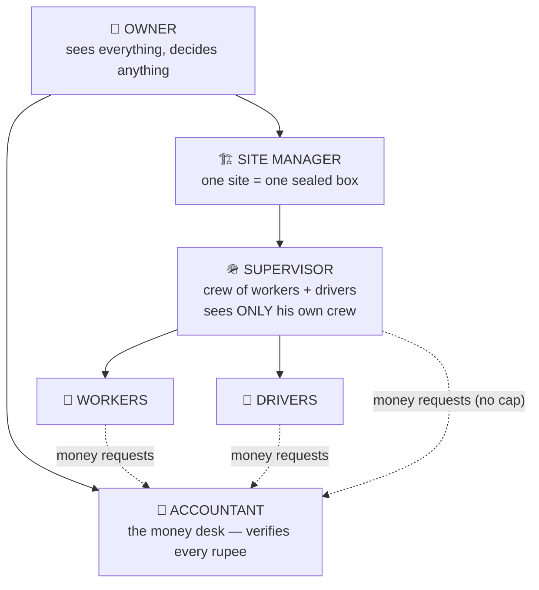
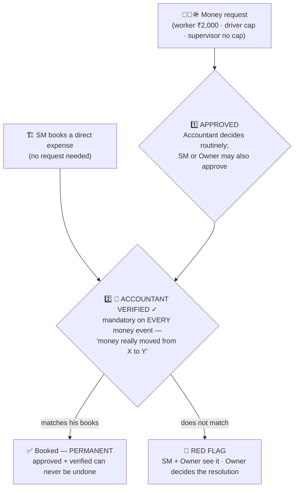
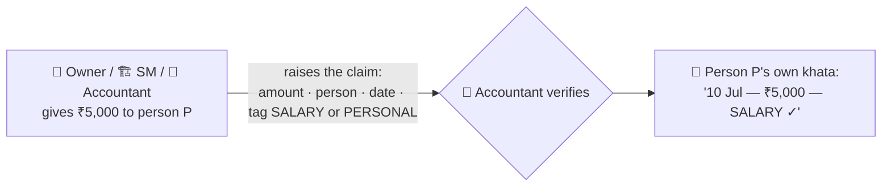
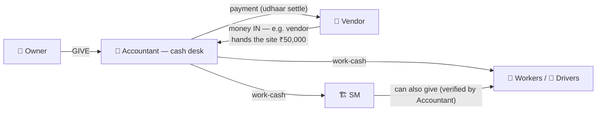
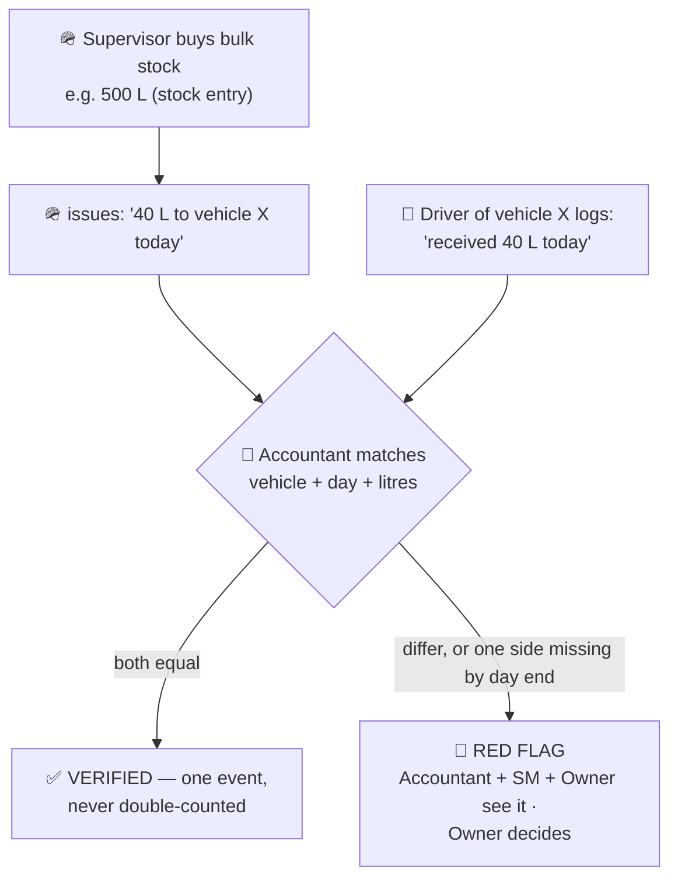
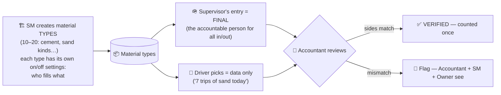
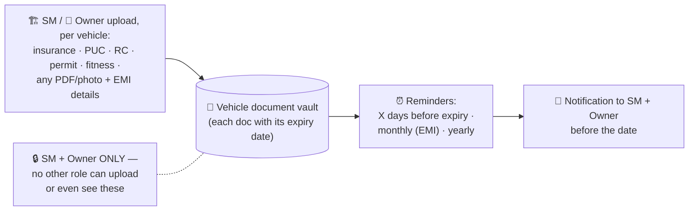
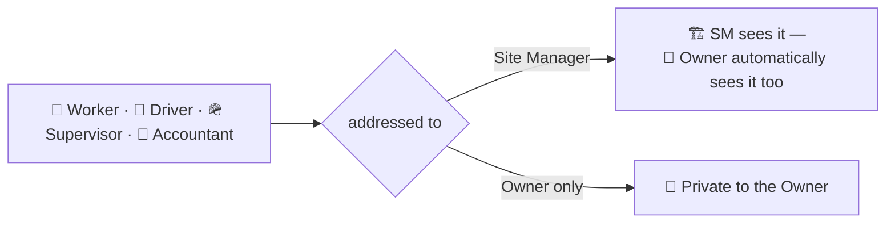

# techBuilder — The Final Plan (complete, current)

> **This is the whole plan in one document** — Round 1 (already built & live) merged with Round 2 (agreed 2026-07-12, being built). A reader who knows nothing about the project can read only this and understand everything. Diagrams as a web page: [`finalindex.html`](finalindex.html). History: [`1stroundplan.md`](1stroundplan.md) · [`2ndroundplan.md`](2ndroundplan.md).

---

## 1 · What this app is

A **Hindi-first web app for a construction company's daily field operations**. Field staff log simple end-of-day records — money spent, work done, diesel used, materials moved — with photo and voice proof. Everything rolls UP to the Site Manager and the Owner. It is a **records + visibility logbook**, not accounting software: the app's job is that *nothing gets lost and nobody can argue about what happened*.

---

## 2 · The 6 roles

| Role | One line |
|---|---|
| 👑 **Owner · मालिक** | Sees everything, everywhere. Final word on anything. |
| 🏗️ **Site Manager · साइट मैनेजर** | Head of ONE site. All site operations + site finances visible. Books expenses directly. |
| 🧮 **Accountant · अकाउंटेंट** | The money desk. **Every rupee-event must carry his VERIFIED tick.** Sees money — and only money. |
| 🪖 **Supervisor · सुपरवाइज़र** | Field boss of a crew of **workers + drivers**. Owns progress, materials, diesel issuing. **Zero money powers.** |
| 🚛 **Driver · ड्राइवर** | Runs one vehicle. Daily meter updates, diesel receipts, trips, damage reports. |
| 👷 **Worker · मज़दूर** | View-only + small money requests. ID card carries his guardian's contact. |

### Structure

### The golden rules

1. **Data flows UP, never sideways.** Everyone fills his own work; the people above can see it.
2. **One-site sealed box.** A Site Manager of Site A never sees one line of Site B. Only the Owner sees all boxes.
3. **Every money event is verified by the Accountant.** No money request is ever auto-approved.
4. **SM-visible ⇒ Owner-visible.** Always.
5. **Every worker and driver has exactly ONE supervisor.** A supervisor sees only his own crew.
6. **No attendance in the app** — for any role. (Kept outside on purpose.)

---

## 3 · The money system

### 3.1 Who can spend / request what

| Role | Request cap | Direct spend |
|---|---|---|
| 👷 Worker | ₹2,000 default (settable per site) | ✗ |
| 🚛 Driver | his own cap (settable) | ✗ |
| 🪖 Supervisor | **NO CAP — any amount** (₹10,000, ₹50,000…) | ✗ ₹0 — everything is a request |
| 🏗️ Site Manager | — | ✓ any amount, **every entry verified by the Accountant** |
| 🧮 Accountant | — | records money moves (give / take / vendor) |
| 👑 Owner | — | ✓ anything |

### 3.2 The two-tick rule — APPROVE + VERIFY

Every money event carries **two marks**:

- The Accountant is the routine approver of field requests. Even when the SM or Owner approves one, **it still waits for the Accountant's verify tick**.
- The Accountant can reject or red-flag anything **before** verification — including a Site Manager's direct expense.
- **Once approved + verified → permanent.** No undo, no re-reject.

### 3.3 Personal money — salary & personal draws

Only **three people can hand money to staff: Owner, Site Manager, Accountant.**

- **Every user gets a "money I've taken" page** — a date-wise list of *only his own verified draws with the tag* ("going home — ₹3,000 — personal"). So everyone always knows exactly what he has already taken — and nothing else.
- Only accountant-verified entries appear. This page exists for worker, driver, supervisor, SM — and the accountant himself.

### 3.4 Cash chain & vendors

- Shops/vendors keep the Round-1 udhaar khata (buy on credit, settle later, full month-wise history) — **plus money-IN**: a trusted vendor can hand the site cash, and the vendor's page shows both directions honestly.
- The Supervisor is **not** a cash node: he holds nothing and hands out nothing.

---

## 4 · The diesel double-check

The Supervisor buys diesel in bulk and issues it to vehicles; every issue is confirmed from two sides.

- Stock balance = purchases − issues, so missing diesel is visible.
- Diesel **averages and insights** (per vehicle, per day/week/month) → **SM + Owner only**. The driver and supervisor only fill data.

---

## 5 · Materials

- Some material types need only the supervisor's log; some need supervisor + driver picks; some are view-only for the driver — **the SM sets this per type** when creating it.
- Anyone allowed can see "today this much of this came / was used".

---

## 6 · Vehicles

| Situation | What happens |
|---|---|
| Driver switches to an **allowed** vehicle type | **No request.** He just logs "changed to vehicle B" → Supervisor + SM get a notification. Done. |
| Driver wants a **non-allowed** type | Request → SM decides. Supervisor is informed. |
| Morning (compulsory) | Meter photo + start reading — every working day. |
| Evening (optional) | Closing reading, hours, trips/loads, note. |
| Damage | Driver raises with photos/voice → SM marks repaired with remark → driver may add closing note. The vehicle's page keeps the full history forever. |
| **Vehicle insights** | Averages (7/30/90-day), diesel per vehicle, monthly running cost — **SM + Owner ONLY.** Not driver, not supervisor, not accountant. |
| **Documents & reminders (NEW — this phase)** | Per-vehicle document vault + expiry/EMI reminders — see below. **SM + Owner ONLY.** |

### Vehicle documents & reminders

- Every vehicle gets a **document vault**: insurance, PUC, RC, permit, fitness — any PDF or photo — each stored with its **expiry date**.
- **EMI dues** for the vehicle are tracked the same way (amount + due day → monthly reminder).
- **Reminders** can be one-time ("X days before the insurance expires"), **monthly** (EMI) or **yearly** — each fires a 🔔 notification to the SM + Owner before the date.
- **Locked down:** only the Site Manager (his site) and the Owner can upload, see, or even know these documents exist. Not the accountant, supervisor, driver or worker.

---

## 7 · Complaint box

- A complaint can carry **text + photos + a video** (roughly 200–300 MB total, video ~100–200 MB).
- Going to the SM always means the Owner can see it as well; going to the Owner directly stays private.

---

## 8 · Worker ID card & guardian details

| Detail | Filled by | Editable later by |
|---|---|---|
| Worker's own mobile | whoever onboards him (supervisor / SM), **once at joining** | **Only the Site Manager** (and Owner) |
| Parent / guardian name | same | same |
| Guardian / emergency mobile | same | same |

Why: if a worker leaves the site without informing anyone, or there is an emergency, the SM or Owner can **call his family directly**. The worker also sees tap-to-call emergency numbers (SM, supervisor, police, ambulance, hospital…).

---

## 9 · Who sees what — the master table

| Surface | 👑 Owner | 🏗️ SM | 🧮 Accountant | 🪖 Supervisor | 🚛 Driver | 👷 Worker |
|---|---|---|---|---|---|---|
| Insights & analytics (averages, totals, rollups) | ✓ all sites | ✓ his site | **✗** | ✗ | ✗ | ✗ |
| 🚩 Red flags (diesel/material/money) | ✓ | ✓ his site | ✓ | ✗ | ✗ | ✗ |
| Approve money requests | ✓ | may approve (still accountant-verified) | ✓ routine decider | ✗ | ✗ | ✗ |
| VERIFY money events | override | ✗ | **✓ his exclusive job** | ✗ | ✗ | ✗ |
| All expenses / cash rollup | ✓ | ✓ his site | ✓ | ✗ | ✗ | ✗ |
| Vendor khata (both directions) | ✓ | ✓ his site | ✓ | ✗ | ✗ | ✗ |
| "Money I've taken" (tagged draws) | ✓ all | ✓ his site | ✓ all + own | own | own | own |
| Guardian details — edit | ✓ | ✓ | ✗ | set once at onboarding | ✗ | ✗ |
| Material types — create/configure | ✓ | ✓ | reviews entries | final entries | picks (data) | ✗ |
| Progress reports | ✓ | ✓ his site | ✗ | ✓ his crew — he files them | own | own |
| Requests visibility | ✓ all | ✓ his site | ✓ all (queue) | **his own crew only** | own | own |
| 📄 Vehicle documents & reminders | ✓ | ✓ his site | ✗ | ✗ | ✗ | ✗ |
| Complaint box | reads all | reads his | can raise | can raise | can raise | can raise |
| Attendance | — | — | — | — | — | — (removed for everyone) |

**The Accountant's screen is a work queue, not a dashboard:** pending requests · approved/rejected today · his own give/take entries · current cash-in-hand. No weekly/monthly analytics — those belong to the SM and Owner.

---

## 10 · Per-role summary

### 👑 Owner
Everything the SM sees (all sites) + everything the Accountant sees (all money) + decide/override any request + resolve every 🚩 flag + company defaults + Excel reports.

### 🏗️ Site Manager
His site end-to-end: day-wise dashboard & insights, direct expenses (accountant-verified), progress, people (add/deactivate/reset), fleet drill-downs + vehicle analytics, **vehicle document vault + expiry/EMI reminders**, material types & their per-type settings, guardian-detail editing, site settings (limits, categories, form fields, emergency numbers), sees every request & flag on his site. Does **not** decide others' money requests — he watches; the Accountant verifies.

### 🧮 Accountant
Approves & verifies every money event (requests, SM expenses, personal draws, vendor moves) — any amount; runs the cash desk; keeps the vendor khata; matches diesel & material entries; watches flags first. **Cannot see** progress, people management, fleet analytics, or settings. His decisions, once verified, are permanent.

### 🪖 Supervisor
Field boss of his crew (workers + drivers). Files site progress (photos/voice), runs materials (final entries), buys & issues diesel, onboards workers (guardian details, once). Raises money requests of **any amount** for site needs — but holds no cash, approves nothing, sees no analytics, and sees only his own crew's requests.

### 🚛 Driver
One vehicle, one supervisor. Morning meter photo (compulsory), evening update (optional), diesel receipts (his side of the match), trips + material picks, damage reports, simple vehicle-change logging. Money requests up to his cap. Sees only his own data + "money I've taken".

### 👷 Worker
ID card (with guardian contact), money requests up to ₹2,000 (default), status of his requests, "money I've taken" page, emergency tap-to-call, complaint box. Everything else invisible.

---

## 11 · Not in this phase

- **Attendance — removed entirely** (was "manual for now" in Round 1; now deliberately out for every role).
- Wages calculation (manual), leave requests, day-photo album, daily PDF (phase-2 candidates). Vehicle-paper expiry alerts are **no longer parked — they ship this phase** as §6 documents & reminders.

## 12 · Small open points

One accountant company-wide or per site? (default: company-wide) · diesel match exact or ±1–2 L? (default: exact) · negative balance allowed on requests? (default: allow, show minus) · WhatsApp evening digest & site-budget alert — yes/no · complaint video size/retention final numbers.
