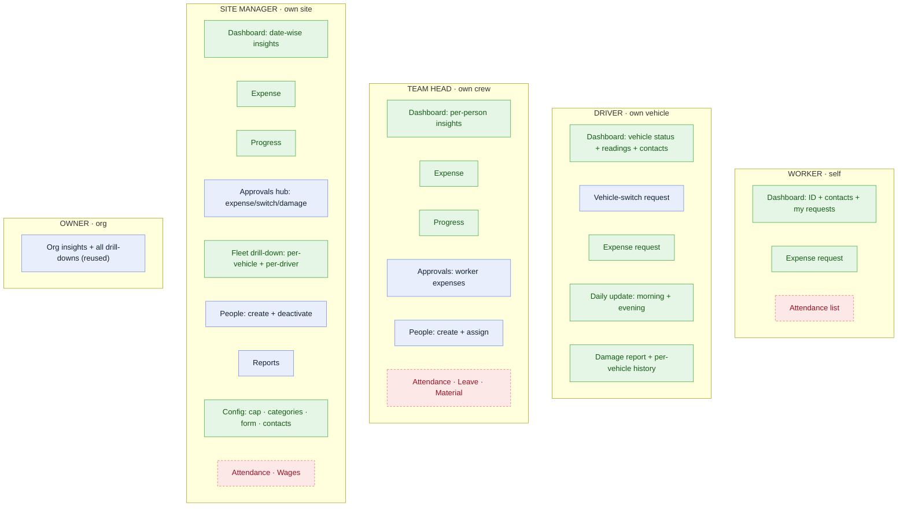
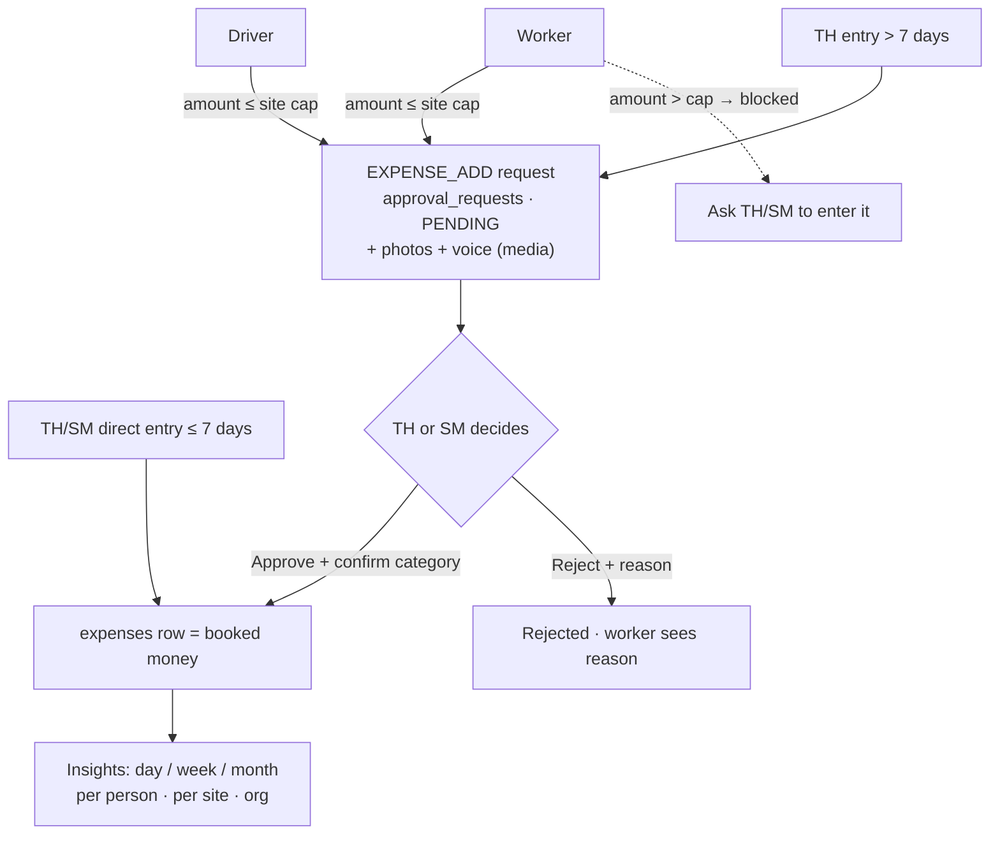
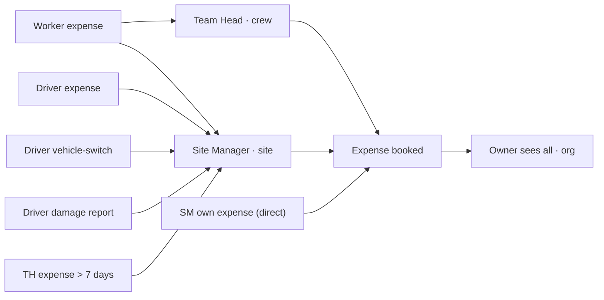

# techBuilder — Role Customization Plan (Post-Review Audit)

> **STATUS: AUDIT IN PROGRESS — PLAN ONLY, NOTHING BUILT YET.**
> This doc captures, role by role, the customizations decided during the manual
> product review. Implementation begins **only after the full audit** (all field
> roles reviewed + plans captured + confirmed). Review order: **Worker → Driver →
> Team Head → Site Manager** (Owner unchanged unless noted).
>
> **How to use this doc:** each role has numbered work-items (e.g. `W2`). Each item
> states *what*, *why*, the *data/contract impact*, and a *file touch-map* keyed to
> `docs/techBuilder-Developer-Guide.md` recipes. Cross-role dependencies are flagged
> ⬥ and get built when we reach that role. Open decisions are flagged ❓ with a
> recommendation — we resolve these before building, not now.

## Conventions (binding — from CLAUDE.md §6 + Dev-Guide §0)
- Money = **integer paise** (`bigint`). Dates = **Kolkata business-date** (`YYYY-MM-DD`). IDs = **client UUIDv7**.
- Every user-facing string goes in **both** `messages.en.ts` and `messages.hi.ts` (Hindi-first).
- `shared/` (`@techbuilder/contracts`) is the **single source of truth**; a change there = a frozen-contract version bump + re-typecheck of all three workspaces.
- "**for now**" removals are **reversible** (feature-flag / comment-out / web-only), not hard-deletes, unless stated.

## Legend
| Mark | Meaning |
|---|---|
| 🟢 | web-only change (`web/`) — reversible, no contract impact |
| 🟡 | backend change (`backend/`) |
| 🔴 | **contract change** (`shared/` + version bump; touches backend enforcement too) |
| ⬥ | cross-role dependency — implemented when we reach that role |
| ❓ | open decision — recommendation given, confirm before building |

---

## GLOBAL / cross-cutting decisions (surfaced during the audit — apply per-role as we build)
These emerged in the Team-Head review but are **phase-scoping decisions that cut across roles**. Applied wherever they appear; **reversible** (comment-out / feature-flag), revisited later.
- **Attendance = OUT for the initial phase.** Done **manually** outside the app. Comment out the Attendance nav + screens for TH/SM (and the Owner attendance view). ⚠️ **Cross-ref:** the **Worker dashboard (W1)** currently shows *this-month attendance* as its main body — ❓ confirm whether to keep the worker's own attendance view or hide it too.
- **Wages = OUT for the initial phase.** Wages/advances handled **manually**. Comment out Wages nav + screens (SM/Owner). (TH never had wages.)
- **Leave requests = REMOVED for now** (TH/SM). Drop `LEAVE` from the request/approval surface for now.
- **Material (usage/move, "trucks/vehicles material") = DEFERRED.** Keep out of records/requests for now; implement later.
- **Focus of the initial phase = money/expenses + daily progress + per-person visibility + photos/voice.** Everything below optimizes for that.

> **Net effect on nav:** field roles' menus shrink to **Dashboard · Expense · Progress · Requests · Approvals · People · (Sites/Fleet/Reports for SM/Owner)** — no Attendance, Wages, Leave, Material for now.

---

## DECISIONS — RESOLVED (2026-07-04)  ✅
These settle the load-bearing ❓ items below; where an inline item still shows ❓, this section wins.
1. **Drivers are site-level, NOT crew members.** A Team Head sees/approves **only his crew's workers**; **driver** requests (expense, switch, damage) route to the **Site Manager**. → No crew-membership change for drivers; TH `OWN_CREW` scope stays worker-only.
2. **One site per Site Manager.** No site switcher; every SM screen is pinned to his single site (`sites.siteManagerId`).
3. **Expense categories = fixed enum + editable labels/subset.** Keep the 6-value `EXPENSE_CATEGORIES` enum + `expenses.category` pgEnum (no DB-type change); OrgConfig/site config chooses the **enabled subset** and **bilingual labels**.
4. **Per-site config with org defaults.** Worker cap, category subset/labels, and expense-form field toggles live **per-site** (SM-editable) with an **org-level default fallback**.
5. **Worker dashboard: attendance HIDDEN.** Worker dashboard = ID card + emergency-contacts footer + **their own expense-request status**. (Revises W1/W-dashboard.)
6. **Reminders (D7) DEFERRED.** Build the morning/evening update **forms** (D4) now; the scheduler + PWA web-push come in a later phase.

---

# PLAN OVERVIEW & LINKAGE (what's shown now → total plan)

### Nav matrix — current vs target
| Role (scope) | Shown today | Target (this plan) |
|---|---|---|
| **Worker** (SELF) | Dashboard (this-month attendance) | Dashboard = ID + **contacts footer** + **my expense requests**; **Expense-request** form. *(attendance hidden)* |
| **Driver** (OWN_VEHICLE) | Dashboard · Vehicle · Requests | Dashboard = vehicle status + readings + **contacts**; **Vehicle-switch req** · **Expense req** · **Daily update (AM/PM)** · **Damage report + history** |
| **Team Head** (OWN_CREW) | Dash · Approvals · Attendance · People · Records · Requests | Dash = **per-person insights**; **Expense** · **Progress** (split) · Approvals *(worker expenses)* · People *(create only)* · Requests *(expense > 7d)*. *(− Attendance, Leave, Material)* |
| **Site Manager** (OWN_SITE) | Dash · Approvals · Attendance · Fleet · People · Records · Reports · Requests · Vehicle · Wages | Dash + **date-wise insights**; **Expense** · **Progress** (split) · **Approvals hub** · **Fleet drill-down** · People *(+deactivate)* · Reports · **Config** *(cap/categories/form/contacts)*. *(− Attendance, Wages, Leave, Material)* |
| **Owner** (ORG) | *(unchanged)* | Reuses the **insights / person / vehicle / driver** drill-downs at **org scope** |

### Diagram 1 — Target sections per role  🟩 new · 🟦 kept · 🟥 removed(for now)

### Diagram 2 — Expense Addition Request lifecycle (the core new flow)

### Diagram 3 — Approval routing (drivers are site-level → go to SM)

### Shared web components — build once, mount per role
| Component | Built in | Mounted for |
|---|---|---|
| `<ContactPanel>` footer | W1 | Worker, Driver (all field dashboards) |
| `expense-screen` (entry + history) | TH-1 | Team Head, Site Manager |
| `expense-request` form (camera/gallery/voice) | W2 | Worker, Driver |
| `progress-screen` (multi-photo + voice, AM/PM) | TH-2 | Team Head, Site Manager |
| date-wise **insights** surface | TH-3 | TH (crew) · SM (site) · Owner (org) |
| `person-detail` drill-down | TH-3 | TH, SM, Owner |
| `vehicle-detail` / `driver-detail` drill-down | SM-5 | SM, Owner |
| approvals **finalize** modal (category → materialize) | SM-3 | TH, SM |
| config screens (cap · categories · form · contacts) | SM-CONFIG | SM (per-site) |

### What must be ADDED — contract & data (one `shared/` bump + one migration)
| Layer | Addition | Serves |
|---|---|---|
| `enums.ts` | `APPROVAL_TYPES += 'EXPENSE_ADD'` | expense requests |
| `permissions.ts` | `WORKER.request.submit = 'SELF'`; **exclude TEAM_HEAD from `deactivate`** | W2 submit; TH-4 |
| `config.ts` (OrgConfig, org default) | expense **category subset + hi/en labels**; **worker cap default**; **backdate windows** (TH=7d, Worker=7d) | decisions 3/4 |
| `db/schema.ts` `sites` | `emergencyContacts jsonb`; `workerExpenseCapPaise money`; `expenseFormConfig jsonb` *(per-site toggles + category overrides)* | W1/D1, cap, SM-CONFIG |
| `db/schema.ts` `vehicle_logs` | `hoursWorked`, `loadsCount`, `note` + photo linkage | D4 |
| `backend` `backdate.util.ts` | TH 2d→**7d**, add Worker window | TH-1, W2 |
| `backend` `approvals.service.ts` | **materialize `expenses` on approve**; cap + backdate enforcement; scoped history | core |
| *(reuse, no new table)* | `issues` for driver **damage** (has `vehicleId`+`mediaIds`); `approval_requests.payload` for the request body; `media` VOICE/PHOTO with `parentType` | D5, W2, attachments |
| *(deferred)* | reminder `NOTIFICATION_TYPES` + scheduler + web-push | D7 later |

---

# WORKER

**Current state:** one read-only screen (`/worker`), `view.all: SELF`. Shows a digital-ID card (name, role, site, phone) + this-month attendance list. No write actions, no other nav.

**Target:** add an **emergency/contacts panel** to the dashboard, and give the worker the ability to **submit an Expense Addition Request** (approval-gated; only becomes a real expense once a TH/SM approves it).

---

## W1 — Dashboard: Emergency & Contacts panel  🟢🟡

**What:** a panel pinned to the **bottom of the worker dashboard** listing tap-to-call contacts, so a worker can call instantly in an emergency:
1. **Their Site Manager** — name + phone (auto-derived).
2. **Their Team Head** — name + phone (auto-derived from their crew).
3. **Site emergency numbers** — Police, Ambulance, Hospital, Fire, Site Office, + free "Other" (curated by the Site Manager, per site).

**Why:** field safety + reduces "call the office to get a number" friction. Read-only for the worker.

**UX:** each row is a big, thumb-friendly `tel:` link (icon + label + number), grouped "People" then "Emergency", high-contrast, works offline (data cached). Mobile-first, prominent.

**Data sourcing:**
- **SM/TH (auto-derived, no new storage):** worker's `users.assignedSiteId` → `sites.siteManagerId` → that user's `name`/`phone`; worker's `users.crewId` → `crews.teamHeadUserId` → that user's `name`/`phone`. *(Backend needs a small scoped read — the worker can't list org users under RLS/scope today, so we expose a dedicated endpoint, see below.)*
- **Site emergency numbers (NEW storage):** the `sites` table has **no contacts field** today. Add site-level emergency contacts.
  - ❓ **Decision — storage shape.** **(Recommended)** add `sites.emergencyContacts jsonb` = `Array<{ kind: 'POLICE'|'AMBULANCE'|'HOSPITAL'|'FIRE'|'SITE_OFFICE'|'OTHER'; label: string; phone: string }>`. Simplest, per-site, read-mostly. *Alt:* a dedicated `site_contacts` table (adds per-row audit/history; heavier). Recommend jsonb for v1.

**Who fills it:** the **Site Manager** ⬥ (curates the emergency numbers on their site). Today `site.manage` is **OWNER-only** — so either (a) give SM an "edit site contacts" affordance scoped to their own site (small targeted permission, not full `site.manage`), or (b) Owner fills it. → captured in the **Site Manager** section as a dependency.

**Backend:** a worker-scoped read that returns the resolved contact panel for the caller:
- `GET /me/contacts` (or fold into an extended `/me`) → `{ siteManager: {name, phone}|null, teamHead: {name, phone}|null, emergency: {kind,label,phone}[] }`, derived server-side from the caller's own assignment/crew + their site's `emergencyContacts`. Keeps the worker's SELF scope intact (no user-list exposure).

**File touch-map** (Dev-Guide §4/§5/§7):
- 🔴 `shared/`: `db/schema.ts` (add `sites.emergencyContacts`), `domain.ts` (add to `Site` + a `ContactPanel` read type), `api.ts` (`meContacts` endpoint). Bump version.
- 🟡 `backend/`: migration (`db:generate`/`migrate`); a resolver in `users`/`me` (or a tiny `contacts` service) returning the panel scoped to the caller.
- 🟢 `web/`: `components/screens/worker-dashboard-screen.tsx` (append the panel), a `ContactPanel` component + `tel:` rows, i18n keys in both catalogs.

---

## W2 — Worker Expense Addition Request  🔴🟡🟢

**What:** a worker fills a simple form to log money they spent in the field (e.g. bought supplies at a shop). Submitting it creates an **Expense Addition Request** — **NOT** a booked expense. It sits **PENDING** until a **Team Head or Site Manager approves** it; only then is it **materialized into a real `expenses` row** and counted against the site. On approval the SM/TH can set/adjust the **category** ("creates the final expense").

**Why:** captures field spend at the source (with proof) without giving workers direct write access to the books; keeps an approval gate + audit trail; lets the SM finalize categorization.

### Form fields (worker side)
| Field | Rule |
|---|---|
| **Amount** | integer paise; required; must be **≤ cap** (see cap rule) |
| **Date** | defaults to **today (Kolkata)**; worker may backdate within a window (see backdating). No arbitrary future/old dates. |
| **Category** | worker picks from the org's expense categories (4–5); **SM can override on approval** |
| **Bill photo** | the **primary** attachment (emphasized in UI); optional at DB level but the intended default |
| **Other photos** | optional, up to ~2–3 more |
| **Remark / comment** | optional free text |
| **Voice note** | optional audio (`media.kind = VOICE` already exists; `OrgConfig.features.voiceNotes` gates it) |
| **Site** | **not shown** — derived from the worker's `assignedSiteId` |

### Model & flow (recommended)
Reuse the **approvals** infrastructure rather than adding a parallel system:
1. **Submit** → one `approval_requests` row: `type = 'EXPENSE_ADD'` 🔴 (new value), `status = 'PENDING'`, `requestedBy = worker`, `payload` jsonb `= { siteId, category, amountPaise, businessDate, billNo?, remark?, mediaIds: [] }`.
2. **Attachments** → `media` rows with `parentType = 'approval_request'`, `parentId = request.id`, kinds `RECEIPT`/`PHOTO`/`VOICE`. (Needs R2 — see media dependency.)
3. **Review** → the request appears in the TH/SM **Approvals** screen with amount, photos, voice, remark. Decider can **change the category** (and ❓ possibly correct the amount — see decision).
4. **Approve** → backend **creates an `expenses` row** from the payload (category = decider's final choice, `receiptMediaId` = the bill photo, `businessDate`, `amountPaise`, `enteredBy` attribution recorded), sets request `APPROVED`. **Now it counts.**
5. **Reject** → request `REJECTED` + `comment` (reason); no expense created; worker sees the reason.

> **Why an approval type and not a "PENDING expense status"?** Keeps `expenses` meaning "booked money" (dashboards/wage/recon already assume that), reuses the requester≠decider + scope rules already hardened in WP-2, and matches the user's mental model ("SM creates the final expense from the request").

### Cap rule (worker submission ceiling) ⬥
- On submit, backend rejects if `amountPaise > cap` with a typed, localized error ("Amount over your limit — ask your Team Head or Site Manager to enter it"). The worker **cannot** create it; TH/SM enter it directly (they already have `record.enter`).
- ❓ **Decision — cap source.** **(Recommended)** per-site cap `sites.workerExpenseCapPaise` (set by the SM ⬥), falling back to an `OrgConfig` org-default. *Alt:* org-only cap in `OrgConfig`. Recommend per-site + org fallback (matches "SM sets a cap on their site").
- ❓ **Decision — does the cap also apply to TH-submitted requests, or only workers?** Brief implies workers only; TH/SM are the escalation path. Recommend: cap applies to **worker** submissions only.

### Categories ("editable") ❓
Today `EXPENSE_CATEGORIES` is a **frozen enum** (`FOOD, SUPPLIES, TRANSPORT, LABOUR, REPAIR, MISC`) and `expenses.category` is a Postgres enum column.
- **(Recommended, v1)** keep the enum, but let **OrgConfig** define the **enabled subset + custom bilingual labels** (`expense.categories: Array<{ key: ExpenseCategory; labelHi; labelEn; enabled }>`). SM/creator picks from the enabled set; labels are editable via config. No DB-type change.
- **(Alt, bigger)** fully dynamic categories → change `expenses.category` from pgEnum to `text` + an org-defined category list. Only if truly custom categories are required. Defer.

### Backdating (worker window) 🟡❓
WP-4 policy today: TH ≤ 2d, SM ≤ 7d, Owner-any (`backend/src/common/backdate.util.ts`).
- ❓ **Decision — worker window.** Brief mentioned "last 3 / last 7 days." **(Recommended)** worker window = **7 days**, ideally reusing the same config knob the SM cap uses (per-site/org configurable). Add `WORKER` to the backdate policy.

### Permissions 🔴
Worker has only `view.all: SELF`. To submit, add `request.submit` for `WORKER` at scope **`SELF`** (or `OWN_SITE`).
- This is an RBAC-matrix change in `shared/src/permissions.ts` → frozen bump. Backend `approvals`/`sync` scope logic must accept a worker-scoped `EXPENSE_ADD` submission (and **only** that type — workers cannot submit LEAVE/VEHICLE_SWITCH/MATERIAL).
- ❓ **Decision — scope value.** Recommend `SELF`: a worker may submit only their own expense requests against their own assigned site; server derives `siteId` (worker never picks it).

### Media / R2 dependency
Photos + voice require Cloudflare R2 (`backend/.env` `R2_*`) — a **known gap** (Dev-Guide §11; `/media/presign` is a local stub). Plan: build the flow so it **degrades gracefully** (submit request without attachments if R2 absent, exactly like the current expense screen), and enable real uploads once R2 keys exist.

### File touch-map
- 🔴 `shared/`: `enums.ts` (`APPROVAL_TYPES += 'EXPENSE_ADD'`); `dto.ts` (`ExpenseRequestPayload` / a typed `SubmitRequestInput` variant); `domain.ts` (payload read type); `config.ts` (`OrgConfig` expense cap default + categories list + worker backdate window); `permissions.ts` (`WORKER.request.submit`); `db/schema.ts` (`sites.workerExpenseCapPaise`). Bump version, rebuild.
- 🟡 `backend/`: migration; `approvals.service.ts` — accept + validate `EXPENSE_ADD` (cap check, backdate check, scope=SELF/site derivation, requester≠decider already enforced); **on approve → create `expenses` row** (transactional, idempotent); attach media as request children; add integration tests (cap reject, backdate reject, approve→expense materialization, worker cannot submit other types).
- 🟢 `web/`: `lib/nav.ts` (Requests nav now visible to worker via `request.submit`); `lib/i18n/*` (all strings, both locales); new `components/screens/expense-request-screen.tsx` (form: amount, date-within-window, category, bill photo + extra photos, remark, voice); `app/worker/requests/page.tsx` wrapper; worker dashboard: surface the worker's own request statuses (pending/approved/rejected). Reuse `records-screen.tsx` / `approvals-screen.tsx` patterns.

---

## Worker → cross-role dependencies (build in the Site Manager phase) ⬥
1. **Site emergency contacts editor** — SM curates `sites.emergencyContacts` for their site (W1). Needs an SM-scoped "edit site contacts" affordance (targeted, not full `site.manage`).
2. **Worker expense cap** — SM sets `sites.workerExpenseCapPaise` (W2 cap rule).
3. **Expense request finalize UI** — the TH/SM Approvals screen must render an `EXPENSE_ADD` request (photos/voice/remark) with a **category selector** and Approve/Reject, and on approve materialize the expense ("SM creates the final expense").
4. **Expense categories config** — if we take the OrgConfig-categories route (W2), the SM/Owner settings surface must edit the enabled set + labels.

## Worker — open decisions (resolve before building) ❓
- W1: emergency-contacts storage — **jsonb on `sites`** (rec) vs dedicated table.
- W2: cap source — **per-site + org fallback** (rec) vs org-only; cap applies to **workers only** (rec).
- W2: categories — **enum + OrgConfig labels/subset** (rec) vs fully dynamic (defer).
- W2: worker backdate window — **7 days**, config-driven (rec).
- W2: `request.submit` scope for worker — **SELF** (rec) vs OWN_SITE.
- W2: on approval, may the decider **edit the amount** (not just category)? (rec: yes, with audit.)

---

# DRIVER

> **Interpretation notes (correct me if any is wrong — brief was dictated):**
> "weightage change" = **vehicle change / switch**; "vital" = **vehicle**; "water / expedition form" = the **same expense-addition pattern as Worker (W2)**; "automated photo" = a **required/mandatory photo** (e.g. odometer at start/end); "porter details / tail in all rows" = the **emergency-contacts panel repeated as a footer** on the dashboard. If any reading is off, fixing it here changes the item below.

**Current state:** dashboard + vehicle (fuel/log) + requests. RBAC: `vehicleLog.enter: OWN_VEHICLE`, `request.submit: OWN_VEHICLE`, `view.all: OWN_VEHICLE` — so the driver **already has** submit + log permissions (most items below need **no** contract bump, unlike Worker).

**Target:** turn the driver dashboard into a day-in-the-life hub — morning + evening vehicle updates (with photos), vehicle-switch request, expense-addition request, damage reports with per-vehicle history, live readings/status, an emergency-contacts footer, and start/end-of-day reminders.

---

## D1 — Emergency & Contacts footer (shared with Worker W1)  🟢
Reuse the **W1** panel (SM + TH auto-derived, site police/ambulance/fire/hospital curated by SM) as a **footer on the driver dashboard** too. Promote it to a **shared `<ContactPanel>` component** so every field-role dashboard can drop it in ("should be on all the rows"). No new backend beyond W1's `/me/contacts`.
- **Touch-map:** 🟢 `web/` shared component + include on `driver` dashboard. Backend/contract already covered by W1.

## D2 — Vehicle Change (Switch) Request  🟡🟢
**What:** a driver has **one active vehicle at a time**. If a target vehicle's **type is in his allowed set** (`driverAllowedTypes` / `users.allowedVehicleTypeIds`), he **switches himself** (no approval). If it's **outside** his allowed set, submitting creates a **`VEHICLE_SWITCH` approval request** (type already exists) routed to his **Site Manager**; on approve, the assignment changes.
- **Reuse:** `approval_requests` type `VEHICLE_SWITCH` + `vehicles.assignedDriverPersonId` + `driverAllowedTypes`. Driver already has `request.submit`.
- ❓ **Decision — allowed set granularity:** allowed by **vehicle *type*** (current model) vs specific vehicles. Recommend keep **by type**.
- ❓ **Decision — self-switch side effects:** flipping the active vehicle updates `vehicles.assignedDriverPersonId` (and frees the previous one?). Confirm one-driver-one-vehicle enforcement.
- **Touch-map:** 🟡 `backend/` approvals: handle `VEHICLE_SWITCH` decide → reassign; a self-switch endpoint for in-allowed-set. 🟢 `web/` a switch form + current-vehicle card on the dashboard; show request status.

## D3 — Expense Addition Request (driver) — shares Worker W2  🟡🟢
Same model as **W2** (`EXPENSE_ADD` approval → materialize `expenses` on TH/SM approve, cap, backdate, bill photo + extra photos + remark + voice). Driver differences:
- **Vehicle-related categories** available (fuel, toll, repair, parts…) alongside the general ones.
- **SM-customizable form** ⬥ — the Site Manager configures the expense-addition form: which **fields show** (boolean toggles), and the **category list** (add/rename). → this is a **form-config** feature captured as a Site-Manager dependency; unify with W2's "editable categories" decision.
- Driver already has `request.submit: OWN_VEHICLE` → **no RBAC bump** (unlike Worker). Site derived from the driver's vehicle/assignment.
- **Touch-map:** shares W2's `shared/` additions; 🟢 `web/` reuse the same `expense-request-screen` with driver category set + the SM-config-driven field visibility.

## D4 — Daily Vehicle Update: morning START + evening END  🟡🟢
**What:** two dashboard sections gated by time of day.
- **Morning (start of day):** required odometer/hours photo ("automated photo") + optional vehicle side/other photos → opens/creates the day's **START** `vehicleLog` (`startReading`).
- **Evening (end of day):** required end-reading photo + a summary — **hours worked**, **number of trips**, **trucks/loads filled**, free **driver-update note**, optional photos → closes the day's **END** `vehicleLog` (`endReading`).
- **Multiple sessions in a day** (e.g. 6h + 6h at night) roll up into the **same business-day** update (hours summed; trips appended). Business-day/EOD-cutoff rules already exist.
- **Visibility:** these updates are readable by **Team Head, Site Manager, Owner** (their dashboards/reports).
- **Reuse:** `vehicleLogs` (START/END, one row per vehicle+day) + `trips` (count) + `media` (photos, `parentType='vehicle_log'`). **New:** fields for hours + trucks-filled + free note → ❓ extend `vehicleLogs` vs a small `driver_day_updates` table. Recommend **extend `vehicleLogs`** (hoursWorked, loadsCount, note) to keep one row/day.
- **Touch-map:** 🔴 `shared/` add the new vehicleLog fields (+ photo linkage) → bump; 🟡 `backend/` vehicle-log upsert accepts them + media; 🟢 `web/` morning/evening update forms as dashboard sections + a "today's update" summary.

## D5 — Damage Report + per-vehicle history  🟡🟢
**What:** driver files a damage report (severity, description, **bill/damage photos + voice note + remark**). The **full history per vehicle** is browsable — a vehicle damaged 3 months ago still shows its photos/voice/remarks.
- **Reuse (clean fit):** the existing **`issues`** table already has `vehicleId`, `severity` (LOW/MED/HIGH), `description`, `status` (OPEN/RESOLVED), `businessDate`, **`mediaIds[]`**. A damage report = an `issue` scoped to a vehicle. History = `issues where vehicleId = X order by businessDate`.
- ❓ **Decision — model:** reuse `issues` (rec, minimal) vs a dedicated `vehicle_damage_reports` table (only if damage needs fields issues lack). Recommend **reuse `issues`**; add a voice-note media kind linkage (already supported).
- **Touch-map:** 🟡 `backend/` allow driver to create a vehicle-scoped `issue` + attach media; a per-vehicle issue-history read. 🟢 `web/` damage-report form + a per-vehicle timeline (photos/voice/remark).

## D6 — Vehicle status & readings visibility  🟡🟢
**What:** on the dashboard the driver sees: **current vehicle** + **status** ("perfectly fine" / MAINTENANCE), **current & yesterday's reading** (odometer/hours), and his **pending switch-request** status.
- **Reuse:** `vehicles.status`; readings **derived** from the latest/previous `vehicleLogs`/`fuelLogs` (no reading column on the vehicle). 
- **Touch-map:** 🟡 `backend/` a driver-scoped "my vehicle snapshot" read (current + yesterday reading + status). 🟢 `web/` a vehicle-status card on the dashboard.

## D7 — Start/End-of-day reminder notifications  🟡🟢❓
**What:** early-morning push → "log your vehicle start update"; end-of-day push → "log your end-of-day update (hours, trips)."
- **New infra:** `NOTIFICATION_TYPES` has no reminder type; needs new types + a **scheduler** (cron) + a **delivery channel**.
- ❓ **Decision — channel:** PWA **web push** (app is a PWA) vs in-app banner on open vs WhatsApp (there's a `whatsappShare` feature). Recommend **web-push (PWA) + in-app banner fallback**; WhatsApp later. Scheduling likely a backend cron.
- **Touch-map:** 🔴 `shared/` new `NOTIFICATION_TYPES`; 🟡 `backend/` scheduler + push send; 🟢 `web/` push subscription + service-worker handler + in-app banner.

---

## Driver → cross-role dependencies (Site Manager phase) ⬥
1. **Expense-addition form config** — SM toggles fields + edits category list (D3); unify with W2 categories.
2. **Approve vehicle-switch requests** (D2) and **expense requests** (D3) in the SM Approvals screen.
3. **See driver daily updates + damage reports** (D4/D5) on SM/TH/Owner dashboards & reports.
4. Emergency-contacts editing (shared with W1).

## Driver — open decisions ❓
- D2: allowed set by **type** (rec) vs specific vehicle; self-switch reassignment side-effects.
- D4: hours/trucks/note storage — **extend `vehicleLogs`** (rec) vs new table; exact "automated photo" = required odometer photo (confirm).
- D5: damage model — **reuse `issues`** (rec) vs dedicated table.
- D7: reminder channel — **web-push + in-app** (rec) vs WhatsApp; scheduler placement.
- Shared: promote emergency panel to a **shared footer** across all field-role dashboards (rec: yes).

# TEAM HEAD

> **Interpretation notes:** "experience/express" = **expense**; "Kirana" = petty/grocery daily spend; "progress code" = **progress report**; "he can add people's role... but cannot deactivate" = TH creates people + assigns role, SM-only can deactivate.

**Current state:** dashboard · approvals · attendance · people · records · requests. RBAC: `user.create/attendance.mark/record.enter/request.submit/request.decide/view.all` all at `OWN_CREW`.

**Target:** a money-and-progress cockpit for the crew — split expense & progress into their own sections, direct expense entry (with a 7-day window), twice-daily progress with lots of photos/voice, per-person drill-down insights, approvals of worker/driver expense requests, and people management (create/assign, not deactivate). **No attendance, no wages, no leave, no material** (see Global block).

---

## TH-0 — Remove / restructure (per Global block)  🟢
- **Comment out** the **Attendance** nav + screen for TH (reversible).
- **Remove** the **Leave** request option from TH's Requests.
- **Defer Material** (not in TH records/requests for now).
- **Split the single "Records" section into two separate nav sections: `Expense` and `Progress`.** Both gated by `record.enter` (no contract change) → two `NAV_DEFS` entries + two screens (`expense-screen`, `progress-screen`) instead of one combined `records-screen`. This restructure applies to **SM too** (shared screens). 🟢 web-only.

## TH-1 — Expense section (entry + history + approvals)  🟡🟢
**Direct entry (no approval):**
- TH adds an expense **manually, directly counted** — amount, category, **photo via camera OR gallery** (both), **remark/comment**, **voice note**. (TH has `record.enter`.)
- **Today's petty/Kirana expense:** same form, any amount, **no approval from anyone** — direct add.
- **Backdate rule (CHANGED):** TH may enter directly for the **last 7 days**. **Older than 7 days → requires approval** (submits an `EXPENSE_ADD` request instead of a direct write). ⚠️ This **changes the current WP-4 policy** (TH was ≤ 2 days) → update `backend/src/common/backdate.util.ts` to TH = 7d, and route over-window entries into the approval flow (shared with Worker W2 / Driver D3).

**History + approvals (read/decide):**
- TH sees **all expense history for his crew's people** (workers/drivers under him) — full history, filterable.
- TH **sees and approves the expense-addition requests** raised by his workers/drivers (`request.decide: OWN_CREW`). The request, who raised it, who approved it, and the resulting expense are **also visible to the Site Manager** (shared visibility up the chain).
- ❓ **Decision — drivers "under" a TH:** brief says TH can see drivers below him. Drivers are vehicle/site-scoped today, not crew members. Confirm whether drivers are attached to a TH's crew (affects the `OWN_CREW` scope for driver expense visibility/approval).

**Touch-map:** shares Worker-W2 `shared/` additions (`EXPENSE_ADD`, categories, cap/window config). 🟡 `backend/` backdate policy change + crew-scoped expense history read + camera/gallery media. 🟢 `web/` dedicated `expense-screen` (entry form with camera+gallery+voice, history list, request-approval inline).

## TH-2 — Progress report section (twice-daily, photo-heavy)  🟡🟢
- **Progress form = shared between Team Head and Site Manager** (same screen/model). Built on `progress_notes` (text + `mediaIds[]` + businessDate — already allows **multiple rows/day**).
- **Twice daily** (morning + evening); **2–3 progress reports/day** allowed. Each: **many site photos (~up to 20)** + **voice note** + text/remark; attach **bills** (photos) too.
- **One covers the day:** if the **TH files a progress report for a day, the SM is not required** to (and vice-versa) — the site/day is considered covered. If **no one files**, the day is marked **"No progress today."** ❓ Decision — "covered" tracked via the existing `completeness` table (SITE scope) vs a simple presence check. Recommend reuse `completeness`.
- **Touch-map:** 🟡 `backend/` progress create accepts many media + voice; completeness rule "TH-or-SM satisfies the day." 🟢 `web/` shared `progress-screen` (multi-photo uploader, voice, morning/evening, "no progress" empty state).

## TH-3 — Per-person drill-down + date-wise insights  🟡🟢
**What:** a **People/insights** view where clicking a person opens **that person's dashboard** — their expenses and progress contributions, "on this day he logged this expense / this progress / filled this much."
- **Date-wise slicing:** Today / This week / This month — separate rollups. This **insight surface is shared by Owner, Site Manager, and Team Head** (same component, scoped per role).
- **Touch-map:** 🟡 `backend/` a person-scoped rollup read (expenses + progress + requests by date bucket), crew-scoped for TH. 🟢 `web/` a `person-detail` screen + date-range tabs; link from the People list. (Reuse for SM/Owner with wider scope.)

## TH-4 — People (create/assign role, NOT deactivate)  🟡🟢
- TH can **add new people and assign a role** (Driver/Worker under him) — cascade already allows `TEAM_HEAD → …` (`users.service.ts CAN_CREATE`).
- TH **can view active people** in his crew.
- TH **cannot deactivate** anyone — **only the Site Manager** (and up) can. Today `deactivate` is gated by "roles you may create, in scope" → **tighten so TEAM_HEAD is excluded from deactivate**. 🟡 small gating change in `users.service.ts` + hide the deactivate action in the TH web People screen.
- ❓ **Decision — confirm exactly which roles TH may create** (Driver + Worker? per current `CAN_CREATE[TEAM_HEAD]`).

---

## Team Head → cross-role dependencies (Site Manager phase) ⬥
1. **Shared Expense & Progress screens** — the split + progress form are shared with SM; build once, mount in both.
2. **Approval visibility up the chain** — SM sees the requests TH approved/raised (TH-1).
3. **Person drill-down / date-wise insights** — reused by SM + Owner with wider scope (TH-3).
4. **Deactivate is SM-only** (TH-4) — SM People screen keeps deactivate.

## Team Head — open decisions ❓
- TH-1: are **drivers** part of a TH's crew scope (visibility/approval)?
- TH-1: confirm **TH backdate window = 7 days** (changes WP-4's 2-day rule).
- TH-2: "day covered by TH-or-SM" via **`completeness`** (rec) vs presence check; max photos (~20) hard cap?
- TH-4: exact roles TH may **create**; confirm **deactivate excluded** for TH.
- Global cross-ref: keep or hide the **Worker dashboard attendance** view given attendance is now manual?

# SITE MANAGER

> **Interpretation notes:** "pages" = **wages** (already flagged manual/OUT); "experience" = **expense**; "quote request from the vehicle" = **vehicle damage / switch requests**; "vehicle change is removed" = on the SM's vehicle view there is **no self-switch** — it's a **read + approve** surface; "general-purpose equipment" = vehicles/equipment shown in the fleet.

**Current state:** dashboard · approvals · attendance · fleet · people · records · reports · requests · vehicle · wages. RBAC: `user.create/vehicle.manage/attendance.mark/record.enter/vehicleLog.enter/request.submit/request.decide/wage.view/report.export/view.all` — all `OWN_SITE`.

**Target:** the single-site command center — strict per-site isolation, date-wise daily insights (expense/progress/requests), direct expense entry (owner-visible), the shared progress form, a per-vehicle & per-driver data drill-down, an approvals hub for everything below him, people management **including deactivate**, and the config surfaces the whole audit has been deferring to him.

---

## SM-1 — STRICT single-site isolation (hard requirement)  🟡
An SM sees **only his own site(s)** — another site is invisible to him. He is the head of his site.
- ⚠️ **Correctness note:** **RLS isolates by `org_id` only, NOT by site.** Cross-site isolation is enforced **entirely** by the per-request scope logic (`loadScope` → `OWN_SITE`, `assertSiteInScope`). So this rule is only as strong as the scope checks on **every SM-facing read**. → **Audit every SM read/list to confirm it filters to the SM's site**, not just the org. Add integration tests: SM of site A must get 0 rows / FORBIDDEN for site B's expenses, progress, vehicles, people, requests, reports.
- ❓ **Decision — can one SM manage multiple sites?** `sites.siteManagerId` is one-SM-per-site, but an SM could head several sites. Confirm: single site only, or the union of sites he manages (affects whether the UI needs a site switcher).
- **Touch-map:** 🟡 `backend/` scope audit + tests. 🟢 `web/` no cross-site data in any SM screen; site context in the header.

## SM-0 — Remove / restructure (per Global block)  🟢
- **Comment out** **Attendance** + **Wages** nav/screens for SM (reversible).
- **Remove Leave**, **defer Material** from SM requests/records.
- Adopt the **Expense / Progress split** (shared screens built in the TH phase, mounted for SM).
- ❓ **Decision — SM `vehicle` (log-entry) nav:** SM has `vehicleLog.enter`, but drivers do the daily logs (D4). Is the SM's vehicle-log-entry screen needed, or should SM's vehicle interest be **read+approve only** (the fleet drill-down SM-5)? Recommend **drop SM log-entry; keep fleet drill-down**.

## SM-2 — Date-wise daily insights (the SM dashboard/reports)  🟡🟢
**What:** pick **any day** → see everything for the site that day: **all progress reports**, **all expenses**, **all requests** (who added / who requested / who approved), each rendered in its own section. Roll up **Today / This week / This month**.
- **Shared surface:** this is the **same date-wise insight component as TH-3**, at **site scope** (SM) — and reused again at **org scope** for the Owner. Build once, scope per role.
- Each **request** raised that day is surfaced in its own card ("show that request in a different form").
- **Touch-map:** 🟡 `backend/` a site-scoped day/period rollup read (progress + expenses + requests, bucketed by date). 🟢 `web/` the shared insights screen + date picker + period tabs; reuse in `site-manager/reports` and dashboard.

## SM-3 — Expense: direct add (owner-visible) + approve requests  🟡🟢
- SM **adds expenses directly** — including bigger ones — **no approval needed** (SM has `record.enter`); **the Owner can see** SM's expenses (Owner `view.all: ORG`). Same form as TH-1 (camera/gallery photo, remark, voice).
- SM is a **decider**: approves the `EXPENSE_ADD` requests from workers/drivers/TH (over-cap or over-window). ⬥ **Finalize UI:** on approve, pick/confirm the **category** and materialize the `expenses` row (the deferred "SM creates the final expense").
- **Touch-map:** shares Worker-W2 backend (materialize-on-approve) + TH-1 entry form. 🟢 `web/` SM expense-screen + approvals finalize modal.

## SM-4 — Progress: shared form + daily site report  🟢
- SM uses the **same progress form as TH** (TH-2): daily photos ("what was done today"), voice, many site photos, bills. **TH-or-SM filing covers the day.**
- **Touch-map:** 🟢 `web/` mount the shared `progress-screen` for SM. (Backend covered in TH-2.)

## SM-5 — Fleet: per-vehicle & per-driver data drill-down  🟡🟢
**What:** the fleet view (`vehicle.manage: OWN_SITE`) with **new-vehicle registration** (regNo) and, on **clicking a vehicle**, its full data page:
- **Odometer/hours reading** (current + history — derived from `vehicleLogs`), **fuel taken** (litres + ₹ from `fuelLogs`), **total expense on that vehicle** + any other expenses, **load/trip data** (`trips`), **damage history** (D5 `issues` by vehicle).
- **Per-driver view:** all data for the vehicle(s) a given driver runs — his logs, fuel, trips/loads, expenses. "All data regarding that driver."
- Vehicles double as **general-purpose equipment** for the site.
- **No self-switch here** — SM **approves** switch requests (SM-6); the vehicle page is read + approve.
- **Touch-map:** 🟡 `backend/` per-vehicle aggregate read (readings/fuel/expense/trips/damage) + per-driver aggregate, site-scoped. 🟢 `web/` fleet list + vehicle-detail drill-down + driver-detail; register-vehicle form.

## SM-6 — Approvals hub (everything below him)  🟢
SM sees & decides **all** requests on his site: **expense-addition** (worker/driver/TH), **vehicle-switch** (driver), **damage** acknowledgements (driver D5). Requester≠decider already enforced (WP-2). Leave/material excluded for now.
- **Touch-map:** 🟢 `web/` the existing `approvals-screen`, extended to render the new request types with the right detail (photos/voice/amount/vehicle).

## SM-7 — People (full management incl. deactivate)  🟡🟢
- SM creates/assigns roles down the cascade (SM → TH/Driver/Worker) and — unlike TH — **can deactivate** people on his site (`users.service.ts deactivate` stays enabled for SM).
- **Touch-map:** 🟢 `web/` SM People screen keeps create + deactivate; 🟡 backend gating unchanged for SM (only TH loses deactivate, TH-4).

## SM-CONFIG — the deferred ⬥ configuration surfaces (SM-owned)
The audit deferred these to the SM; build them here:
1. **Expense-addition form config** — SM toggles which fields show (booleans) + edits the **category list** (add/rename) for the worker/driver expense form (W2/D3). ❓ storage: `OrgConfig` vs per-site config; recommend per-site override + org default.
2. **Worker expense cap** — SM sets `sites.workerExpenseCapPaise` for his site (W2 cap rule).
3. **Site emergency contacts editor** — SM curates `sites.emergencyContacts` (police/ambulance/fire/hospital/site-office) shown in the contacts footer (W1/D1). Needs an SM-scoped "edit site contacts" affordance (targeted, not full `site.manage` which is Owner-only today). ❓ grant SM a narrow site-contacts edit permission vs let Owner fill it.
4. **Expense categories** — if OrgConfig-driven (W2 decision), SM/Owner edit the enabled set + bilingual labels here.

---

## Site Manager — open decisions ❓
- SM-1: **multi-site SM** allowed (site switcher) or strictly one site?
- SM-0: drop SM's **vehicle-log-entry** nav (rec) — read+approve only?
- SM-3: confirm **SM expenses never need approval** regardless of amount (cap = workers/drivers only).
- SM-CONFIG: expense-form config + cap + contacts + categories **storage** (per-site vs OrgConfig; recommend per-site override + org default) and the **narrow site-contacts permission** for SM.

---

# ✅ AUDIT COMPLETE — consolidated build backlog (fill after decisions confirmed)

All four field roles are captured. Before building, we resolve the open ❓ decisions, then implement in dependency order:

1. **`shared/` contract bump (once):** `APPROVAL_TYPES += EXPENSE_ADD`; `WORKER.request.submit`; expense cap + categories + backdate config in `OrgConfig`; `sites.emergencyContacts` + `sites.workerExpenseCapPaise`; new `vehicleLog` fields (hours/loads/note); new reminder `NOTIFICATION_TYPES`; the `ContactPanel`/insight read types. One version bump, one migration.
2. **`backend/`:** materialize-on-approve; cap + backdate (TH=7d) enforcement; crew/site-scoped history + per-person + per-vehicle + per-driver rollups; **SM cross-site scope audit + tests**; deactivate gating (TH excluded); reminder scheduler (D7).
3. **`web/` shared components (build once, mount per role):** `<ContactPanel>` footer; split `expense-screen` + `progress-screen`; `expense-request` form (camera/gallery/voice); date-wise **insights** surface; **person-detail** drill-down; **vehicle-detail** / **driver-detail** drill-down; approvals finalize modal; SM config screens. Comment out Attendance/Wages/Leave/Material nav.
4. **Verify:** per-role E2E + the isolation tests + confirm rows land in Neon scoped correctly.

---

# 🔁 CLIENT FEEDBACK — ROUND 1 (2026-07-04, binding; supersedes conflicting items above)

Client reviewed `docs/techBuilder-Client-Plan.html` and replied by point code. All accepted and folded into the client plan. Deltas vs the plan above:

## Changes to existing items
| Code | Change |
|---|---|
| **W-3** | Worker backdate window **7d → 3d** (today + 2 days back). TH/SM continue to see approved request data in history (confirmed, already planned). |
| **D-2** | Morning vehicle update = **COMPULSORY every working day**. |
| **D-3** | Evening update = **OPTIONAL (skippable)**; if skipped, day closes with next morning's reading. Rename field "end reading" → **"current reading"**. Form must be **extensible** (client may add fields; site-level form config). D-2+D-3 feed per-day hours/km + running-cost visibility for SM/Owner. |
| **D-4** | Confirmed: categories per-site SM-custom + **boolean field toggles** (matches SM-CONFIG). |
| **D-5** | **Self-switch (within allowed types) must NOTIFY the SM** — info-only, not approval ("Driver X changed vehicle A → B"). Reuse existing `ASSIGNMENT_CHANGED` notification type — no new enum value needed. |
| **D-6** | Damage gets a **lifecycle**: driver raises → SM marks **RESOLVED + resolution remark** → driver may add optional **closing remark**. `issues.status` OPEN/RESOLVED exists; needs storage for the two remarks (add `resolutionNote` + `closingNote` columns, or comments jsonb — decide at contract bump). |
| **S-1** | Beyond the dashboard summary: a **dedicated full Insights page**. Date presets: yesterday · day-before · last 7 days · last 30 days · any date. Day view = all worker entries + full expense history + all requests. |
| **S-2** | ⚠️ **NEW RULE: SM direct expense above ₹1,00,000 requires OWNER approval** (per entry). Below = instant book. Implement as an `EXPENSE_ADD` request decided by the Owner; threshold configurable (org default ₹1L). |
| **S-5** | **Vehicle photos (1–2)** on the vehicle profile (media, `parentType='vehicle'`). **Vehicle analytics** (SM+Owner): avg running per day over **7/30/90 days**, fuel litres+₹, **monthly running cost**. Explicitly NO vehicle-vs-vehicle comparison. Derived reads — no new tables. |
| **N-4** | Material/stock tracking stays out of this phase, BUT becomes a **client-consultation item now** — collect his current process + pain points, design next phase. |

## Suggestion decisions
- **SUG-3 ACCEPTED → promoted to feature "V" (vendor accounts)** — see below.
- **SUG-4 ACCEPTED — Phase 2** (day photo album, TH/SM add, SM/Owner view).
- **SUG-5 ACCEPTED — build later** (daily one-page PDF).
- **SUG-6 ACCEPTED — Phase 2**, SM + Owner only (vehicle doc expiry alerts).
- **SUG-1, SUG-2 — awaiting client decision.**

## ★ NEW FEATURE M — Money Ledger (advance / petty-cash "khata")
The business runs on advance cash handed down (Owner → SM → TH/Worker/Driver). Track it:
- **M-1 Cash transfer record** — giver records `amount · to whom · date · note`. New table `cash_transfers` (orgId, siteId?, fromUserId, toUserId, amountPaise, businessDate, note) + RLS. *(Distinct from the existing `advances` table = wage advances — do NOT conflate.)*
- **M-2 Balance** = transfers received − transfers given − **approved cash expenses** by that person. Expense gains **`paidVia: 'CASH' | 'VENDOR_CREDIT'`** (schema + dto + form). Cash expense deducts spender's balance on approval (or instantly for TH/SM direct).
- **M-3 My khata** — every role sees own `received / spent / balance` (a small card on each dashboard).
- **M-4 Owner rollup** — per transfer chain: who used it, on which categories ("₹1L → 50k diesel, 20k workers, 18k material, 12k balance").
- **Open (asked to client in doc):** receiver "received ✓" confirmation? negative-balance allowed or block requests above balance?
- **Assumed:** transfers flow down the chain only (Owner→SM, SM→TH/Driver/Worker, TH→Worker).

## ★ NEW FEATURE V — Vendor / shop accounts (udhaar khata)
- **V-1 Shop list per site** — SM manages (name, phone, sells-what). `vendors` table EXISTS (name, phone); needs `siteId`(?) + CRUD endpoints (verify: no vendors module in backend today) + web screen.
- **V-2 Buy on credit** — expense form gets **paid-by choice: cash (cuts my balance) vs credit at [shop]** (`expenses.vendorId` already exists!). Credit expense → site expense + shop outstanding; nothing cut from personal balance. Same approval rules.
- **V-3 Shop ledger** — per shop: total purchased · total paid · balance owed, month-wise. New table `vendor_payments` (vendorId, amountPaise, businessDate, note, paidBy). SM/Owner record payments; Owner sees all khatas.

## Updated TO-DO (additions to the consolidated backlog)
- [ ] shared: `paidVia` on expense dto/schema · `cash_transfers` (with `kind: GIVE|RETURN`) + `vendor_payments` tables + RLS · issue resolution/closing remark fields · vehicle photo linkage · threshold configs (SM ₹1L + TH ₹25k default, per-site adjustable) · worker+driver window 3d · D-3 fields (already planned hoursWorked/loadsCount/note)
- [ ] backend: cash-transfer module + balance derivation · vendor CRUD + payments + ledger read · owner-decides flow for >₹1L SM entries · self-switch → ASSIGNMENT_CHANGED notification · damage resolve/close endpoints · vehicle analytics read (7/30/90d avg + monthly cost) · insights day/period read (S-1)
- [ ] web: khata card (all roles) · give-money form (Owner/SM) · paid-by selector in expense forms · vendor screens (list/ledger/payments) · full Insights page + date presets · vehicle profile photos + analytics block · damage resolve/close UI · D-2 compulsory / D-3 optional handling
- [ ] Phase-2 parking lot: SUG-4 album · SUG-5 PDF · SUG-6 doc alerts · N-4 material design workshop · D7 push reminders
- [ ] Refresh `docs/techBuilder-Role-Blueprint.html` (technical) at build kickoff — now partially stale (7d→3d, ₹1L rule, M/V features).

## Open questions — RESOLVED (2026-07-04, user)
1. ✅ Driver expense-request window = **3 days** (same as worker).
2. ✅ ₹1L owner-approval = **per single entry** (3 × ₹50k same day = no approval). **NEW: the TH also gets a per-entry ceiling — above it, his entry routes as a request to the SM.** Default **₹25,000** (dev-picked, ADJUSTABLE per site via SM-CONFIG / org default — ⚠️ confirm the number with the client).
3. ✅ Ledger transfers flow **down the chain, PLUS returns up the chain** — e.g. someone going on leave returns his remaining balance; recorded like any transfer and balances adjust. → `cash_transfers.kind: 'GIVE' | 'RETURN'`. (Negative-balance question still pending with the client — M-4.)
4. ✅ Vendor list = **per-site** (each site has its own local shops).

### Threshold ladder (final)
| Who | Direct entry allowed | Above the line |
|---|---|---|
| Worker / Driver | never (request-only, ≤ cap, ≤ 3 days back) | blocked at submit |
| Team Head | ≤ ₹25,000/entry (default, per-site adjustable), ≤ 7 days back | → request to SM |
| Site Manager | ≤ ₹1,00,000/entry, any date | → request to Owner |
| Owner | unlimited | — |

**Limit-editing rule (user, 2026-07-04):** every threshold is editable by the person **one level above** — the **Owner edits the SM's ₹1L** ceiling; the **SM edits the TH ceiling and the worker/driver caps**. Config placement: worker/driver caps + TH ceiling live in SM-CONFIG (per site); the SM ceiling lives in an Owner settings surface (org default + per-site override).
